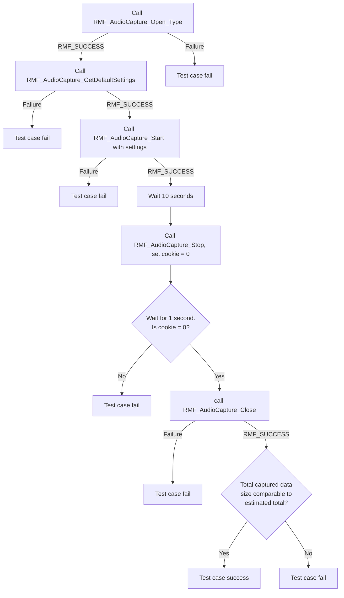
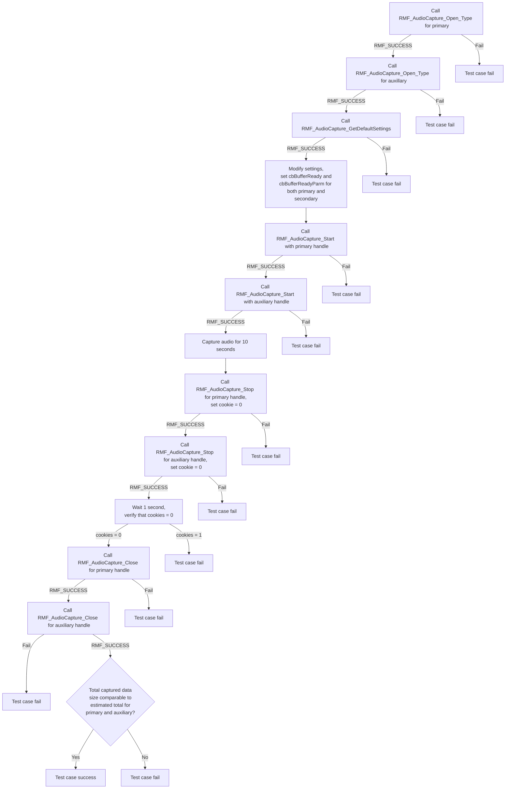

# RMF AUDIO CAPTURE L2 Low Level Test Specification and Procedure Documentation

## Table of Contents

- [Overview](#overview)
- [Acronyms, Terms and Abbreviations](#acronyms-terms-and-abbreviations)
- [References](#references)
- [Level 2 Test Procedure](#level-2-test-procedure)

## Overview

This document describes the level 2 testing suite for the RMF AUDIO CAPTURE module.

### Acronyms, Terms and Abbreviations

- `HAL` \- Hardware Abstraction Layer, may include some common components
- `UT`  \- Unit Test(s)
- `OEM`  \- Original Equipment Manufacture
- `SoC`  \- System on a Chip

### References

- `High Level Test Specification` - [rmf-audio-capture_High-Level_TestSpec.md](rmf-audio-capture_High-Level_TestSpec.md)

## Level 2 Test Procedure

The following functions are expecting to test the module operates correctly.

### Test 1

| Title | Details |
| -- | -- |
| Function Name | `test_l2_rmfAudioCapture_primary_data_check` |
| Description | Run primary audio capture for 10 seconds and verify receipt of commensurate amount of audio samples. Verify that there are no more data ready callbacks issued after the RMF_AudioCapture_Stop returns |
| Test Group | Module : 02 |
| Test Case ID | 1 |
| Priority | High |

**Pre-Conditions :**
None

**Dependencies :**
None

**User Interaction :**
If user chose to run the test in interactive mode, then the test case has to be selected via console.

**Test Procedure :**

| Variation / Steps | Description | Test Data | Expected Result | Notes|
| ----------------- | ----------- | ---------- | -------------- | ----- |
| 01 | Call `RMF_AudioCapture_Open()` to open interface | handle = valid pointer | RMF_SUCCESS | Should be successful |
| 02 | Call `RMF_AudioCapture_GetDefaultSettings()` to get default settings | valid settings | returns RMF_SUCCESS | Should be successful |
| 03 | Call `RMF_AudioCapture_Start()` with settings obtained above to start audio capture | settings=default settings from previous step, data callback will increment a static byte counter every time it runs. Data callback will also set an atomic int cookie variable to 1 every time it runs, status callback NULL | RMF_SUCCESS | Should be successful |
| 04 | Capture audio for 10 seconds | sleep(10) | N/A | N/A |
| 05 | Call `RMF_AudioCapture_Stop` with handle and set cookie variable to 0 immediately afterwards | handle = valid pointer | RMF_SUCCESS | Should be successful |
| 06 | Sleep for 1 second and verify that no more callbacks have arrived by verifying that cookie variable remains 0| N/A | cookie=0 | Should be successful |
| 07 | Call `RMF_AudioCapture_Close()` to release resources | current handle | RMF_SUCCESS | Should be successful |
| 08 | Compare actual total bytes logged by data callback with expected total. Expected total = 10 * byte-rate computed from audio parameters in default settings | byte rate = num. channels * bytes per channel * sampling frequency | Actual bytes received must be within 10% margin of error of expected | Should be successful |

### Test 2

| Title | Details |
| -- | -- |
| Function Name | `test_l2_rmfAudioCapture_auxiliary_data_check` |
| Description | Run auxiliary audio capture for 10 seconds and verify receipt of commensurate amount of audio samples. Verify that there are no more data ready callbacks issued after the RMF_AudioCapture_Stop returns |
| Test Group | Module : 02 |
| Test Case ID | 002 |
| Priority | High |

**Pre-Conditions :**
Device must support auxiliary audio capture.

**Dependencies :**
None

**User Interaction :**
If user chose to run the test in interactive mode, then the test case has to be selected via console.

**Test Procedure :**

| Variation / Steps | Description | Test Data | Expected Result | Notes|
| -- | --------- | ---------- | -------------- | ----- |
| 01 | Call `RMF_AudioCapture_Open_Type()` to open interface | handle = valid pointer, type=auxiliary | RMF_SUCCESS | Should be successful |
| 02 | Call `RMF_AudioCapture_GetDefaultSettings()` to get default settings | valid settings | returns RMF_SUCCESS | Should be successful |
| 03 | Call `RMF_AudioCapture_Start()` with settings obtained above to start audio capture | settings=default settings from previous step, data callback will increment a static byte counter every time it runs. Data callback will also set an atomic int cookie variable to 1 every time it runs, status callback NULL | RMF_SUCCESS | Should be successful |
| 04 | Capture audio for 10 seconds | sleep(10) | N/A | N/A |
| 05 | Call `RMF_AudioCapture_Stop` with handle and set cookie variable to 0 immediately afterwards | handle = valid pointer | RMF_SUCCESS | Should be successful |
| 06 | Sleep for 1 second and verify that no more callbacks have arrived by verifying that cookie variable remains 0| N/A | cookie=0 | Should be successful |
| 07 | Call `RMF_AudioCapture_Close()` to release resources | current handle | RMF_SUCCESS | Should be successful |
| 08 | Compare actual total bytes logged by data callback with expected total. Expected total = 10 * byte-rate computed from audio parameters in default settings | byte rate = num. channels * bytes per channel * sampling frequency | Actual bytes received must be within 10% margin of error of expected | Should be successful |

### Test 3

| Title | Details |
| -- | -- |
| Function Name | `test_l2_rmfAudioCapture_combined_data_check` |
| Description | Run auxiliary+primary audio capture for 10 seconds and verify receipt of commensurate amount of audio samples. Verify that there are no more data ready callbacks issued after the RMF_AudioCapture_Stop returns. |
| Test Group | Module : 02 |
| Test Case ID | 003 |
| Priority | High |

**Pre-Conditions :**
Device must support auxiliary audio capture.

**Dependencies :**
None

**User Interaction :**
If user chose to run the test in interactive mode, then the test case has to be selected via console.

**Test Procedure :**

| Variation / Steps | Description | Test Data | Expected Result | Notes|
| -- | --------- | ---------- | -------------- | ----- |
| 01 | Call `RMF_AudioCapture_Open_Type()` to open interface | handle = valid pointer; type = "auxiliary" | RMF_SUCCESS | Should be successful |
| 02 | Call `RMF_AudioCapture_Open_Type()` to open interface | handle = valid pointer; type = "primary" | RMF_SUCCESS | Should be successful |
| 03 | Call `RMF_AudioCapture_GetDefaultSettings()` to get default settings | valid settings pointer | returns RMF_SUCCESS | Should be successful |
| 04 | Call `RMF_AudioCapture_Start()` with settings obtained above to start audio capture | handle = primary handle, settings initalized to default settings, data callback will increment a static byte counter every time it runs. Data callback will also set an atomic int cookie variable to 1 every time it runs, cbBufferReadyParm = pointer to primary capture context with byte counter and cookie, status callback NULL | RMF_SUCCESS | Should be successful |
| 05 | Call `RMF_AudioCapture_Start()` with settings obtained above to start audio capture | handle = auxiliary handle, settings initalized to default settings, data callback will increment a static byte counter every time it runs. Data callback will also set an atomic int cookie variable to 1 every time it runs, cbBufferReadyParm = pointer to auxiliary capture context with byte counter and cookie, status callback NULL | RMF_SUCCESS | Should be successful |
| 06 | Capture audio for 10 seconds | sleep(10) | N/A | Should be successful |
| 07 | Call `RMF_AudioCapture_Stop` with primary handle and set primary context cookie variable to 0 immediately afterwards | handle = primary | RMF_SUCCESS | Should be successful |
| 08 | Call `RMF_AudioCapture_Stop` with auxiliary handle and set auxiliary context cookie variable to 0 immediately afterwards | handle = auxiliary | RMF_SUCCESS | Should be successful |
| 09 | Sleep for 1 second and verify that no more callbacks have arrived by verifying that cookie variables for both primary and auxiliary contexts remain 0| N/A | primary and auxiliary cookies = 0 | Should be successful |
| 10 | Call `RMF_AudioCapture_Close()` to release resources | current primary handle | RMF_SUCCESS | Should be successful |
| 11 | Call `RMF_AudioCapture_Close()` to release resources | current auxiliary handle | RMF_SUCCESS | Should be successful |
| 12 | Compare actual total bytes logged by data callbacks for both primary and auxiliary contexts with expected total. Expected total = 10 * byte-rate computed from audio parameters in default settings | byte rate = num. channels * bytes per channel * sampling frequency | Actual bytes received must be within 10% margin of error of expected | Should be successful |

