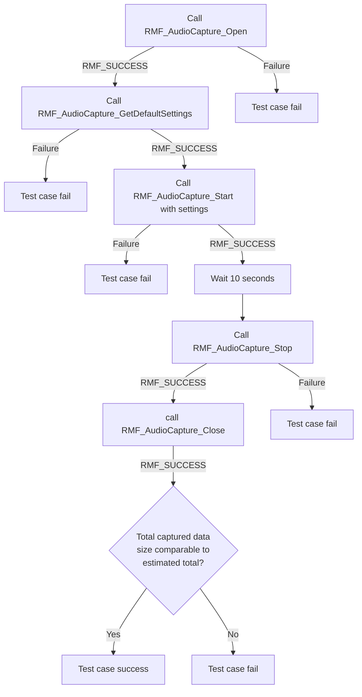
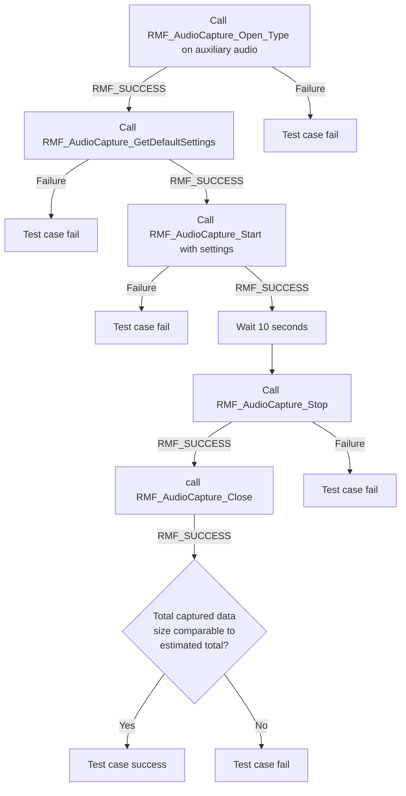
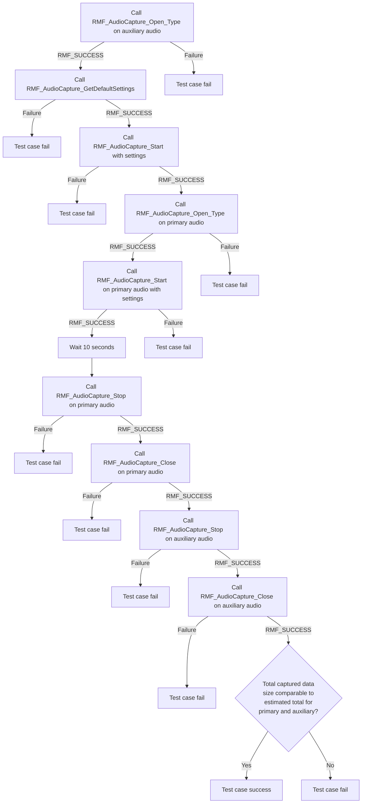

# RMF_AudioCapture L2 low-level test specification and procedure documentation

## Table of contents

- [RMF\_AudioCapture L2 low-level test specification and procedure documentation](#rmf_audiocapture-l2-low-level-test-specification-and-procedure-documentation)
  - [Table of contents](#table-of-contents)
  - [Overview](#overview)
    - [Acronyms, terms and abbreviations](#acronyms-terms-and-abbreviations)
    - [Definitions](#definitions)
    - [References](#references)
  - [Level 2 test procedure](#level-2-test-procedure)
    - [Test 1: test satisfactory data transfer for primary audio capture](#test-1-test-satisfactory-data-transfer-for-primary-audio-capture)
    - [Test 2: test satisfactory data transfer for auxiliary audio capture](#test-2-test-satisfactory-data-transfer-for-auxiliary-audio-capture)
    - [Test 3: test satisfactory data transfer with simultaneous primary and auxiliary capture](#test-3-test-satisfactory-data-transfer-with-simultaneous-primary-and-auxiliary-capture)

## Overview

This document describes the Level 2 Test Specification and Procedure for the RMF_AudioCapture module.

### Acronyms, terms and abbreviations

- `HAL` \- Hardware Abstraction Layer
- `UT`  \- Unit Test(s)
- `OEM`  \- Original Equipment Manufacturer
- `SoC`  \- System on a Chip
- `RDK`  \- Reference Development Kit
- `RMF`  \- RDK Media Framework

### Definitions

  - `ut-core` \- Common Testing Framework <https://github.com/rdkcentral/ut-core>, which wraps an open-source framework that can be expanded to the requirements for future frameworks.

### References
- `High Level Test Specification` - [rmf-audio-capture_High-Level_TestSpec.md](rmf-audio-capture_High-Level_TestSpec.md)
- `HAL Interface file` -  [RMF_AudioCapture HAL header](https://github.com/rdkcentral/rdk-halif-rmf_audio_capture/blob/main/include/rmfAudioCapture.h)

## Level 2 test procedure  

### Test 1: test satisfactory data transfer for primary audio capture

|Title|Details|
|--|--|
|Function Name|`test_l2_rmfAudioCapture_primary_data_check`|
|Description| Start capture of primary audio and verify that `HAL` triggers data callback with enough frequency and data in order to keep up with the expected data rate, tested over 10 seconds |
|Test Group| 02 |
|Test Case ID| 1 |
|Priority| high |

**Pre-conditions :** 
Device must be actively playing audio.

**Dependencies :** None

**User interaction :** None

#### Test Procedure :

| Variation / Steps | Description | Test Data | Expected Result | Notes|
| -- | --------- | ---------- | -------------- | ----- |
| 01 | Call `RMF_AudioCapture_Open()` to open interface | handle must be a valid pointer | RMF_SUCCESS | Should pass |
| 02 | Call `RMF_AudioCapture_GetDefaultSettings()` to get default settings | valid settings | returns RMF_SUCCESS | Should pass |
| 03 | Call `RMF_AudioCapture_Start()` with settings obtained above to start audio capture | settings=default settings from previous step, data callback will increment a static byte counter every time it runs, status callback NULL | RMF_SUCCESS | Should pass |
| 04 | Call `RMF_AudioCapture_Stop()` to stop capture after 10 seconds | valid handle | RMF_SUCCESS | Should pass |
| 05 | Call `RMF_AudioCapture_Close()` to release resources | current handle | RMF_SUCCESS | Should pass |
| 06 | Compare actual total bytes logged by data callback with expected total. Expected total = 10 * byte-rate computed from audio parameters in default settings | byte rate = num. channels * bytes per channel * sampling frequency | Actual bytes received must be within 10% margin of error of expected | Should pass |  

### Test 2: test satisfactory data transfer for auxiliary audio capture

|Title|Details|
|--|--|
|Function Name|`test_l2_rmfAudioCapture_auxiliary_data_check`|
|Description| Start capture of auxiliary audio and verify that `HAL` triggers data callback with enough frequency and data in order to keep up with the expected data rate, tested over 10 seconds |
|Test Group| 02 |
|Test Case ID| 2 |
|Priority| high |

**Pre-conditions :**
Device must support auxiliary audio. Device must be actively playing audio. Audio source must carry auxiliary audio track.

**Dependencies :** None

**User interaction :** None

#### Test Procedure :

| Variation / Steps | Description | Test Data | Expected Result | Notes|
| -- | --------- | ---------- | -------------- | ----- |
| 01 | Call `RMF_AudioCapture_Open_Type()` to open interface | handle must be a valid pointer; type is auxiliary | RMF_SUCCESS | Should pass |
| 02 | Call `RMF_AudioCapture_GetDefaultSettings()` to get default settings | valid settings | RMF_SUCCESS | Should pass |
| 03 | Call `RMF_AudioCapture_Start()` with settings obtained above to start audio capture | settings=default settings from previous step, data callback will increment a static byte counter every time it runs, status callback NULL | RMF_SUCCESS | Should pass |
| 04 | Call `RMF_AudioCapture_Stop()` to stop capture after 10 seconds | valid handle | RMF_SUCCESS | Should pass |
| 05 | Call `RMF_AudioCapture_Close()` to release resources | current handle | RMF_SUCCESS | Should pass |
| 06 | Compare actual total bytes logged by data callback with expected total. Expected total = 10 * byte-rate computed from audio parameters in default settings | byte rate = num. channels * bytes per channel * sampling frequency | Actual bytes received must be within 10% margin of error of expected | Should pass |  

### Test 3: test satisfactory data transfer with simultaneous primary and auxiliary capture

|Title|Details|
|--|--|
|Function Name|`test_l2_rmfAudioCapture_combined_data_check`|
|Description| Start capture of both primary and auxiliary audio and verify that `HAL` triggers data callback with enough frequency and data in order to keep up with the expected data rate, tested over 10 seconds |
|Test Group| 02 |
|Test Case ID| 3 |
|Priority| high |

**Pre-conditions :**
Device must support auxiliary audio. Device must be actively playing audio. Audio source must carry auxiliary audio track.

**Dependencies :** None

**User interaction :** None

#### Test Procedure :

| Variation / Steps | Description | Test Data | Expected Result | Notes|
| -- | --------- | ---------- | -------------- | ----- |
| 01 | Call `RMF_AudioCapture_Open_Type()` to open interface | handle must be a valid pointer; type is auxiliary | RMF_SUCCESS | Should pass |
| 02 | Call `RMF_AudioCapture_GetDefaultSettings()` to get default settings | valid settings | returns RMF_SUCCESS | Should pass |
| 03 | Call `RMF_AudioCapture_Start()` with settings obtained above to start audio capture | settings=default settings from previous step, data callback will increment a static byte counter every time it runs, status callback NULL | RMF_SUCCESS | Should pass |
| 04 | Call `RMF_AudioCapture_Open_Type()` to open interface | handle must be a valid pointer; type is primary | RMF_SUCCESS | Should pass |
| 05 | Call `RMF_AudioCapture_Start()` with settings obtained above to start audio capture | settings=default settings from previous step, data callback will increment a static byte counter every time it runs, status callback NULL | RMF_SUCCESS | Should pass |
| 06 | Call `RMF_AudioCapture_Stop()` to stop capture after 10 seconds | valid primary handle | RMF_SUCCESS | Should pass |
| 07 | Call `RMF_AudioCapture_Stop()` to stop capture after 10 seconds | valid auxiliary handle | RMF_SUCCESS | Should pass |
| 08 | Call `RMF_AudioCapture_Close()` to release resources | current primary handle | RMF_SUCCESS | Should pass |
| 09 | Call `RMF_AudioCapture_Close()` to release resources | current auxiliary handle | RMF_SUCCESS | Should pass |
| 10 | Compare actual total bytes logged by data callback with expected total. Expected total = 10 * byte-rate computed from audio parameters in default settings | byte rate = num. channels * bytes per channel * sampling frequency | Actual bytes received must be within 10% margin of error of expected | Should pass |  

