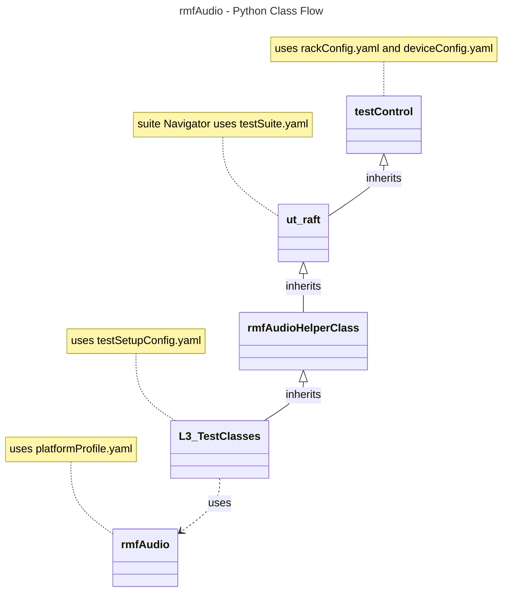

# RMF Audio Capture L3 Low Level Test Specification and Procedure Documentation

## Table of Contents
  - [Acronyms, Terms and Abbreviations](#acronyms-terms-and-abbreviations)
  - [Overview](#overview)
  - [References](#references)
  - [Audio Streams Requirement](#audio-streams-requirement)
  - [Level 3 Test Procedure](#level-3-test-cases-high-level-overview)
  - [Level 3 Python Test](#level-3-python-test-cases-high-level-overview)

### Acronyms, Terms and Abbreviations

- `HAL`    - Hardware Abstraction Layer
- `API`    - Application Programming Interface
- `L2`     - Level 2 Testing
- `L3`     - Level 3 Testing
- `DUT`    - Device Under Test
- `NA`     - Not Applicable
- `RAFT`   - Rapid Automation Framework for Testing

## Overview

This document describes the L3 Test Procedure for the RMF Audio Capture module.

## References

- RMF audio capture HAL Interface - [rmfAudioCapture.h](https://github.com/rdkcentral/rdk-halif-rmf_audio_capture/tree/main/include/rmfAudioCapture.h)
- High Level Test Specification - [rmf-audio-capture_High-Level_TestSpec.md](./rmf-audio-capture_High-Level_TestSpec.md)

## Audio Streams Requirement

| #   | Stream Name                  | Description                                             |
| --- | ---------------------------- | ------------------------------------------------------- |
| 01  | Sin_120s_48k_stereo.wav      | 120 seconds sin wave generated at 48kz, stereo file     |
| 02  | Triangle_10s_480k_stereo.wav | 10 seconds triangle wave generated at 48kz, stereo file |

## Level 3 Test Cases High Level Overview

Below are top test use-case for the RMF audio capture.
| #   | Test-case              | Description                                                                                                                                                                                                                    | HAL APIs                                                                                                                                 | Streams Number |
| --- | ---------------------- | ------------------------------------------------------------------------------------------------------------------------------------------------------------------------------------------------------------------------------ | ---------------------------------------------------------------------------------------------------------------------------------------- | -------------- |
| 1   | Primary data capture   | Play a reference stream, run primary audio capture, verify that captured audio is faithful to the source within margin of error                                                                                                | `RMF_AudioCapture_Open_Type, RMF_AudioCapture_GetDefaultSettings, RMF_AudioCapture_Start, RMF_AudioCapture_Stop, RMF_AudioCapture_Close` | 1              |
| 2   | Primary jitter test    | Play a reference stream, run primary audio capture, monitor jitter regularly                                                                                                                                                   | `RMF_AudioCapture_Open_Type, RMF_AudioCapture_GetDefaultSettings, RMF_AudioCapture_Start, RMF_AudioCapture_Stop, RMF_AudioCapture_Close` | 1              |
| 3   | Independent data check | Play reference streams simultaneously for primary and auxiliary captures, issue a series of start and stop calls in a mixed sequence that verifies that primary and audio capture sessions are truly independent of each other | `RMF_AudioCapture_Open_Type, RMF_AudioCapture_GetDefaultSettings, RMF_AudioCapture_Start, RMF_AudioCapture_Stop, RMF_AudioCapture_Close` | 1,2            |
| 4   | Auxiliary data capture | Play a reference stream, run auxiliary audio capture, verify that captured audio is faithful to the source within margin of error                                                                                              | `RMF_AudioCapture_Open_Type, RMF_AudioCapture_GetDefaultSettings, RMF_AudioCapture_Start, RMF_AudioCapture_Stop, RMF_AudioCapture_Close` | 2              |
| 5   | Combined data capture  | Play reference streams simultaneously for primary and auxiliary captures, run primary and auxiliary audio captures, verify that captured audio is faithful to the source within margin of error                                | `RMF_AudioCapture_Open_Type, RMF_AudioCapture_GetDefaultSettings, RMF_AudioCapture_Start, RMF_AudioCapture_Stop, RMF_AudioCapture_Close` | 1,2            |
| 6   | Auxiliary jitter test  | Play a reference stream, run auxiliary audio capture, monitor jitter regularly                                                                                                                                                 | `RMF_AudioCapture_Open_Type, RMF_AudioCapture_GetDefaultSettings, RMF_AudioCapture_Start, RMF_AudioCapture_Stop, RMF_AudioCapture_Close` | 2              |
| 7   | Combined jitter test   | Play reference streams simultaneously for primary and auxiliary captures, run primary and auxiliary audio captures, monitor jitter regularly                                                                                   | `RMF_AudioCapture_Open_Type, RMF_AudioCapture_GetDefaultSettings, RMF_AudioCapture_Start, RMF_AudioCapture_Stop, RMF_AudioCapture_Close` | 1,2            |

## Level 3 Python Test Cases High Level Overview

The class diagram below illustrates the flow of rmfAudio L3 Python test cases:

- **testControl**
  - Test Control Module for running rack Testing. This module configures the `DUT` based on the rack configuration file provided to the test.
  - This class is defined in `RAFT` framework. For more details refer [RAFT](https://github.com/rdkcentral/python_raft/blob/1.0.0/README.md)
- **ut_raft**
  - Python based testing framework for writing engineering tests.
  - It provides common functionalities like menu navigation, configuration reader, reading user response etc.
  - For more details [ut-raft](https://github.com/rdkcentral/ut-raft).
- **rmfAudio**
  - This is test helper class which communicates with the `L3` C/C++ test running on the `DUT` through menu
- **L3_TestClasses**
  - These are the L3 test case classes
  - Each class covers the each test use-case defined in [L3 Test use-cases](#level-3-test-cases-high-level-overview) table

### YAML File Inputs

- **rackConfig.yaml**
  - Identifies the rack configuration and platform used
  - References platform-specific config from `deviceConfig.yaml`
  - For more details refer [RAFT](https://github.com/rdkcentral/python_raft/blob/1.0.0/README.md) and [example_rack_config.yml](https://github.com/rdkcentral/python_raft/blob/1.0.0/examples/configs/example_rack_config.yml)

- **deviceConfig.yaml**
  - Specifies overall configuration for the platform
  - Can be overridden by:
    - Changing locally .yaml file directory
    - Using --deviceConfig command line switch
  - For more details refer [RAFT](https://github.com/rdkcentral/python_raft/blob/1.0.0/README.md) and [example_device_config.yml](https://github.com/rdkcentral/python_raft/blob/1.0.0/examples/configs/example_device_config.yml)

- **componentProfile.yaml/platformProfile.yaml**
  - Contains component-specific configurations
  - Contains platform wide configuration broken down into separate components
  - Example configuration file [rmfAudioCaptureAuxSupported](https://github.com/rdkcentral/rdk-halif-test-rmf_audio_capture/blob/develop/profiles/rmfAudioCaptureAuxSupported.yaml)

- **testSetupConfig.yaml**
  - This configuration file contains the list of requirements for tests to execute. Eg: Copying the streams, setting environment variables etc.
  - Example configuration file [rmfAudio_L3_testSetup.yml](../../../host/tests/rmfAudio_L3_TestCases/rmfAudio_L3_testSetup.yml)

- **testConfig.yaml**
  - This configuration file contains the list of menu items for C/C++ L3 test running on `DUT`
  - Example configuration file [rmfAudio_testConfig.yml](../../../host/tests/rmfAudioClasses/rmfAudio_testConfig.yml)
