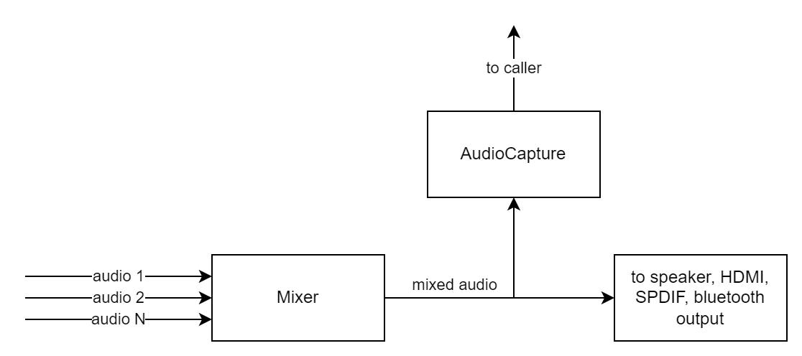

# RMF Audio Capture Test Specification Documentation

## Table of Contents

- [Overview](#overview)
- [Acronyms, Terms and Abbreviations](#acronyms-terms-and-abbreviations)
- [Definitions](#definitions)
- [References](#references)
- [Acronyms, Terms and Abbreviations](#acronyms-terms-and-abbreviations)
- [Module Description](#module-description)
- [Test Functionality](#test-functionality)
- [Test Procedure](#test-procedure)

## Overview

This document provides an overview of the testing requirements for the RMF audio capture module. It outlines the scope of testing, objectives, testing levels and approaches, specific test requirements, and expected deliverables.

### Acronyms, Terms and Abbreviations

- `HAL` \- Hardware Abstraction Layer, may include some common components
- `UT`  \- Unit Test(s)
- `OEM`  \- Original Equipment Manufacture (Sky is also an OEM)
- `SoC`  \- System on a Chip

### Definitions

- `Unit Tests` \- C Function tests that run on the target hardware
- `Common Testing Framework` \- Off the shelf 3rd Party Testing Framework, or framework that does not require infrastructure to control it. That's not to say it cannot be controlled via infrastructure if required. Examples of which are.
  - `GTest` \- Google Test Suit <https://google.github.io/googletest>
  - `CUnit` \- C Testing Suit <http://cunit.sourceforge.net/>
  - `Unity` \- C Embedded Testing Suit <http://www.throwtheswitch.org/unity>
  - `ut-core` \- Common Testing Framework <https://github.com/comcast-sky/rdk-components-ut-core>, which wraps a open-source framework that can be expanded to the requirements for future comcast-sky framework.

### References

- RMF Audio Capture `HAL` Specification Document \- <https://github.com/rdkcentral/rdk-halif-rmf_audio_capture/blob/main/docs/pages/rmf-audio-capture_halSpec.md>
- RMF Audio Capture `HAL` Interface file \- <https://github.com/rdkcentral/rdk-halif-rmf_audio_capture/blob/main/include/rmfAudioCapture.h>

## Module Description

The purpose of audio capture is to tap the final mix of the decoded audio. The audio data delivered via this interface must closely track the audio being rendered by the device at any given point in time, aiming for minimal latency. The RMF audio capture functionality must be capable of capturing primary audio and, optionally, auxiliary audio (such as alternate language tracks). When auxiliary audio is supported, the `HAL` must be able to handle concurrent capture sessions for both primary and auxiliary audio.For more details please check the [References](#references)

## Test Functionality

|#|Test Functionality|Description|Level2|Level3|
|-|------------------|-----------|------|------|
|1 |Start RMF Audio capture module |Start the module with no data feed to check for errors |Y|N|
|2 |Capture audio data with known input streams |Validate captured audio data |N|Y|
|3 |Captured audio data |Control the module and captured audio data |N|Y|

## Test Procedure

Level2 Test Specification and Procedure can be found [here](./rmf-audio-capture_L2_TestSpec_Procedure.md)

Level3 Test Specification and Procedure can be found [here](./rmf-audio-capture_L3_TestSpec_Procedure.md)
