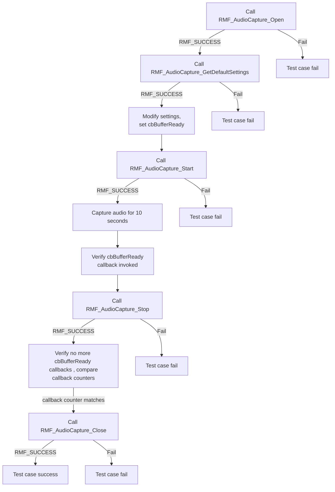
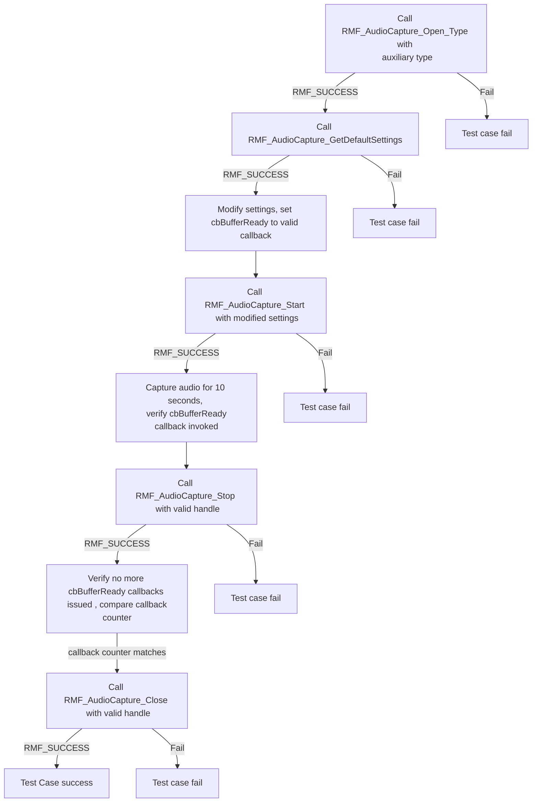
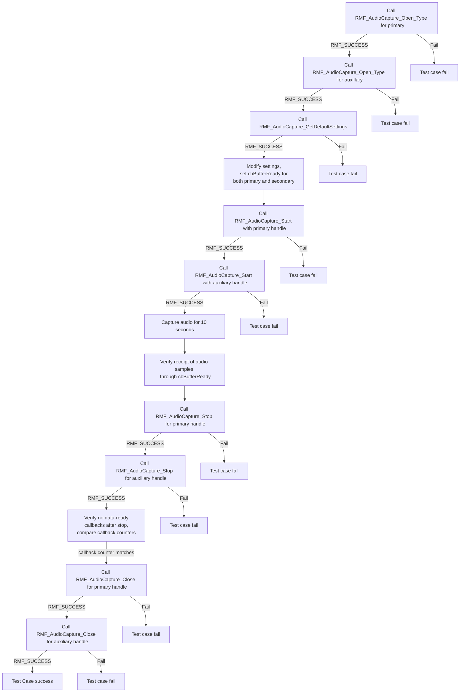

# RMFAUDIOCAPTURE L2 Low Level Test Specification and Procedure Documentation

## Table of Contents

- [RMFAUDIOCAPTURE L2 Low Level Test Specification and Procedure Documentation](#rmfaudiocapture-l2-low-level-test-specification-and-procedure-documentation)

  - [Table of Contents](#table-of-contents)
  - [Overview](#overview)
    - [Acronyms, Terms and Abbreviations](#acronyms-terms-and-abbreviations)
    - [Definitions](#definitions)
    - [References](#references)
  - [Level 2 Test Procedure](#level-2-test-procedure)

## Overview

This document describes the level 2 testing suite for the RMFAUDIOCAPTURE module.

### Acronyms, Terms and Abbreviations

- `HAL` \- Hardware Abstraction Layer, may include some common components
- `UT`  \- Unit Test(s)
- `OEM`  \- Original Equipment Manufacture
- `SoC`  \- System on a Chip

### Definitions

  - `ut-core` \- Common Testing Framework <https://github.com/rdkcentral/ut-core>, which wraps a open-source framework that can be expanded to the requirements for future framework.

### References
- `High Level Test Specification` - [rmf-audio-capture_High-Level_TestSpec.md](rmf-audio-capture_High-Level_TestSpec.md)

## Level 2 Test Procedure

The following functions are expecting to test the module operates correctly.

### Test 1

| Title | Details |
| -- | -- |
| Function Name | `test_l2_rmfAudioCapture_RunPrimaryAudioCapture` |
| Description | Run primary audio capture for 10 seconds and verify receipt of commensurate amount of audio samples. Verify that there are no more data ready callbacks issued after the RMF_AudioCapture_Stop returns |
| Test Group | Module : 02 |
| Test Case ID | 1 |
| Priority | High |

**Pre-Conditions :**
None

**Dependencies :**
None

**User Interaction :**
If user chose to run the test in interactive mode, then the test case has to be selected via console.

#### Test Procedure :

| Variation / Steps | Description | Test Data | Expected Result | Notes |
| -- | --------- | ---------- | -------------- | ----- |
| 01 | Call `RMF_AudioCapture_Open` with a valid handle | handle = valid pointer | RMF_SUCCESS | Should be successful |
| 02 | Call `RMF_AudioCapture_GetDefaultSettings` with valid settings | settings = valid pointer | RMF_SUCCESS | Should be successful |
| 03 | Modify settings to use `test_l2_dummy_data_cb_primary` | settings.cbBufferReady = test_l2_dummy_data_cb_primary, settings.cbBufferReadyParm = NULL | N/A | N/A | Should be successful |
| 04 | Call `RMF_AudioCapture_Start` with handle and modified settings | handle = valid pointer, settings = modified settings | RMF_SUCCESS | Should be successful |
| 05 | Capture audio for 10 seconds | sleep(10) | N/A | N/A | Should be successful |
| 06 | Verify callback invocation and audio samples received | N/A | N/A | Should be successful |
| 07 | Call `RMF_AudioCapture_Stop` with handle | handle = valid pointer | RMF_SUCCESS | Should be successful |
| 08 | Verify no more callbacks after stop by comparing callback counter value immediately and sometime after stop| N/A | callback counter value matches | Should be successful |
| 09 | Call `RMF_AudioCapture_Close` with handle | handle = valid pointer | RMF_SUCCESS | Should be successful |

### Test 2

| Title | Details |
| -- | -- |
| Function Name | `test_l2_rmfAudioCapture_RunAuxiliaryAudioCapture` |
| Description | Run auxiliary audio capture for 10 seconds and verify receipt of commensurate amount of audio samples. Verify that there are no more data ready callbacks issued after the RMF_AudioCapture_Stop returns |
| Test Group | Module : 02 |
| Test Case ID | 002 |
| Priority | High |

**Pre-Conditions :**
None

**Dependencies :**
None

**User Interaction :**
If user chose to run the test in interactive mode, then the test case has to be selected via console.

#### Test Procedure :

| Variation / Steps | Description | Test Data | Expected Result | Notes |
| -- | --------- | ---------- | -------------- | ----- |
| 01 | Set test ID and log entry into function | gTestID = 2 | N/A | Should be successful |
| 02 | Call `RMF_AudioCapture_Open_Type` with valid handle and auxiliary type | handle = valid pointer, type = "auxiliary" | RMF_SUCCESS | Should be successful |
| 03 | Call `RMF_AudioCapture_GetDefaultSettings` with valid settings pointer | settings = valid pointer | RMF_SUCCESS | Should be successful |
| 04 | Modify `RMF_AudioCapture_Settings` | settings.cbBufferReady = test_l2_dummy_data_cb_auxillary, settings.cbBufferReadyParm = NULL | N/A | Should be successful |
| 05 | Call `RMF_AudioCapture_Start` with valid handle and modified settings | handle = valid handle, settings = modified settings | RMF_SUCCESS | Should be successful |
| 06 | Capture audio for 10 seconds and verify callback | sleep(10) | N/A | Should be successful |
| 07 | Call `RMF_AudioCapture_Stop` with valid handle | handle = valid handle | RMF_SUCCESS | Should be successful |
| 08 | Verify no more callbacks after stop by comparing callback counter value immediately and sometime after stop | N/A | callback counter value matches | Should be successful |
| 09 | Call `RMF_AudioCapture_Close` with valid handle | handle = valid handle | RMF_SUCCESS | Should be successful |

### Test 3

| Title | Details |
| -- | -- |
| Function Name | `test_l2_rmfAudioCapture_RunAuxiliaryPrimaryAudioCapture` |
| Description | Run auxiliary+primary audio capture for 10 seconds and verify receipt of commensurate amount of audio samples. Verify that there are no more data ready callbacks issued after the RMF_AudioCapture_Stop returns. |
| Test Group | Module : 02 |
| Test Case ID | 003 |
| Priority | High |

**Pre-Conditions :**
None

**Dependencies :**
None

**User Interaction :**
If user chose to run the test in interactive mode, then the test case has to be selected via console.

#### Test Procedure :

| Variation / Steps | Description | Test Data | Expected Result | Notes |
| -- | --------- | ---------- | -------------- | ----- |
| 01 | Call `RMF_AudioCapture_Open_Type` to open the primary audio capture interface | primaryHandle = NULL, type = "primary" | RMF_SUCCESS | Should be successful |
| 02 | Call `RMF_AudioCapture_Open_Type` to open the auxiliary audio capture interface | auxiliaryHandle = NULL, type = "auxiliary" | RMF_SUCCESS | Should be successful |
| 03 | Call `RMF_AudioCapture_GetDefaultSettings` to get the default settings for audio capture | settings = valid buffer | RMF_SUCCESS | Should be successful |
| 04 | Get a copy of settings ,modify the settings, ensuring `cbBufferReady` is set to valid callback functions | settings.cbBufferReady = test_l2_dummy_data_cb_primary, settings_aux.cbBufferReady = test_l2_dummy_data_cb_auxillary | N/A | Should be successful |
| 05 | Call `RMF_AudioCapture_Start` with the primary audio capture handle and modified settings | primaryHandle = valid handle, settings = modified settings | RMF_SUCCESS | Should be successful |
| 06 | Call `RMF_AudioCapture_Start` with the auxiliary audio capture handle and modified settings | auxiliaryHandle = valid handle, settings_aux = modified settings | RMF_SUCCESS | Should be successful |
| 07 | Capture audio for 10 seconds | sleep(10) | N/A | Should be successful |
| 08 | Verify the receipt of the commensurate amount of audio samples through the `cbBufferReady` callback | N/A | RMF_SUCCESS | Should be successful |
| 09 | Call `RMF_AudioCapture_Stop` for the primary audio capture handle | primaryHandle = valid handle | RMF_SUCCESS | Should be successful |
| 10 | Call `RMF_AudioCapture_Stop` for the auxiliary audio capture handle | auxiliaryHandle = valid handle | RMF_SUCCESS | Should be successful |
| 11 | Verify that no more data-ready callbacks are issued after `RMF_AudioCapture_Stop` returns by comparing callback counter value immediately and sometime after stop for both primary and auxillary| N/A | callback counter matches| Should be successful |
| 12 | Call `RMF_AudioCapture_Close` for the primary audio capture handle | primaryHandle = valid handle | RMF_SUCCESS | Should be successful |
| 13 | Call `RMF_AudioCapture_Close` for the auxiliary audio capture handle | auxiliaryHandle = valid handle | RMF_SUCCESS | Should be successful |

